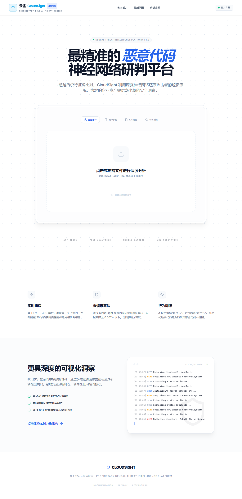
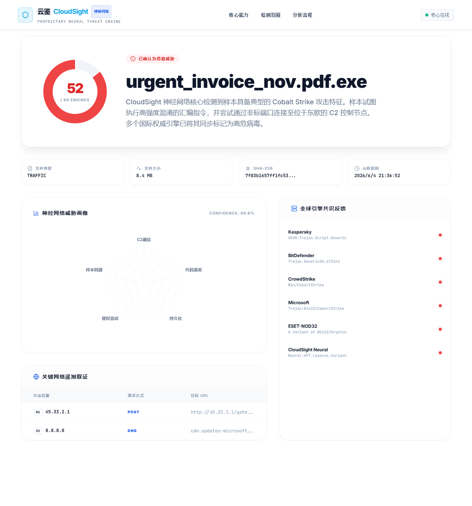
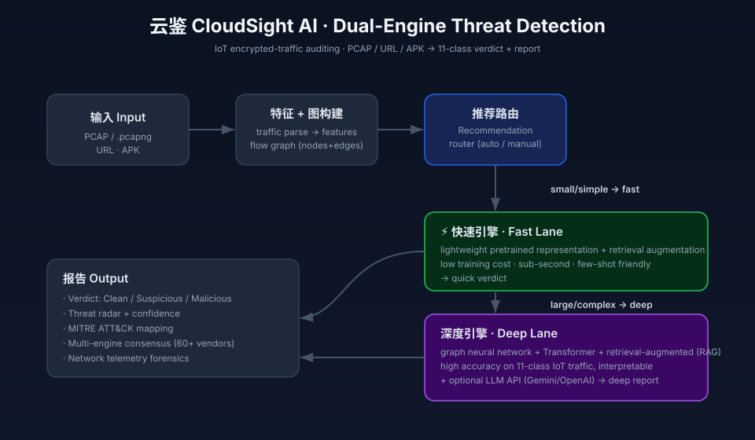

# 云鉴 CloudSight AI

**双引擎 IoT 加密流量威胁检测平台 · Dual-Engine IoT Encrypted-Traffic Threat Detection**

[🌐 在线体验 Live Demo](https://forlives.github.io/cloudsight-ai/) · [English](#english) · [中文](#中文)

-lightgrey?style=flat-square)

---

> **👉 直接体验 / Try it now:** https://forlives.github.io/cloudsight-ai/
> 浏览器打开即可交互（演示模式，内置示例数据，无需安装）。
> Opens in your browser — interactive demo mode with built-in sample data, nothing to install.

### 首页 Home

### 研判报告 Analysis Report

### 系统架构 Architecture

---

## 中文

云鉴 CloudSight 是一个面向 **物联网（IoT）加密流量** 的威胁检测与研判平台。一次流量上传，经特征 / 图结构构建后，由"推荐路由"分发给两条互补的检测引擎：

| 引擎 | 定位 | 思路 | 特点 |
|------|------|------|------|
| ⚡ **快速引擎**（快车道） | 秒级快速检测 | 轻量化预训练表征 + 检索增强 | 训练开销小、小样本友好、亚秒级响应 |
| 🧠 **深度引擎**（慢车道） | 深度研判 + 报告 | 图神经网络 + Transformer + 检索增强 (RAG) | 高准确率、可解释、适合复杂样本 |

> **推荐模式**：平台根据样本规模与复杂度自动选择引擎——小 / 简单流量走快车道秒出结论，大 / 复杂流量走慢车道做深度研判；也支持手动指定。深度车道可选接入大模型 API（Gemini / OpenAI）输出自然语言威胁解读。

### 能力一览
- **输入**：PCAP / .pcapng / .cap、URL、APK
- **威胁类型（11 类）**：Benign、DDoS、DoS、Mirai、Okiru、Scan、C&C、FileDownload、HeartBeat、Torii、PartOfAHorizontalPortScan
- **特征**：真实流量解析 → 流量特征向量 → 流图（节点 + 边）
- **报告**：裁决（Clean / Suspicious / Malicious）+ 威胁雷达 + MITRE ATT&CK 映射 + 多引擎共识 + 网络取证

### 技术栈
React 18 · TypeScript · Vite · TailwindCSS · Recharts · 图神经网络 + Transformer + RAG（后端）

### 📦 关于源码
本仓库当前提供**在线体验版**与产品 / 架构说明。**完整源码（前端 + 后端 + 模型与训练代码）将在相关论文发表后开源。** 在线 Demo 使用内置示例数据，便于直接感受交互与产品形态。

⭐ 觉得有意思的话点个 Star，论文发表、源码开放时你会第一时间在动态里看到。

---

## English

CloudSight is a threat-detection and analysis platform for **IoT encrypted traffic**. A single upload is parsed into features / a flow graph, then a *recommendation router* dispatches it to one of two complementary engines:

| Engine | Role | Idea | Highlights |
|--------|------|------|-----------|
| ⚡ **Fast Engine** (fast lane) | sub-second verdict | lightweight pretrained representation + retrieval augmentation | low training cost, few-shot friendly, sub-second |
| 🧠 **Deep Engine** (deep lane) | deep analysis + report | graph neural network + Transformer + retrieval-augmented (RAG) | high accuracy, interpretable, fits complex samples |

> **Recommendation mode**: the platform auto-selects an engine by sample size / complexity — small / simple flows take the fast lane, large / complex ones take the deep lane (manual override supported). The deep lane can optionally call an LLM API (Gemini / OpenAI) for a natural-language threat report.

### Capabilities
- **Inputs**: PCAP / .pcapng / .cap, URL, APK
- **11 threat classes**: Benign, DDoS, DoS, Mirai, Okiru, Scan, C&C, FileDownload, HeartBeat, Torii, PartOfAHorizontalPortScan
- **Features**: real traffic parsing → feature vector → flow graph (nodes + edges)
- **Report**: verdict + threat radar + MITRE ATT&CK mapping + multi-engine consensus + network forensics

### Tech stack
React 18 · TypeScript · Vite · TailwindCSS · Recharts · GNN + Transformer + RAG (backend)

### 📦 About the source
This repository currently provides a **live demo** plus product / architecture documentation. **The full source code (frontend + backend + model & training code) will be open-sourced after the associated papers are published.** The live demo runs on built-in sample data so you can experience the interaction and product design right away.

⭐ If this looks interesting, drop a Star — you'll be the first to know when the papers land and the source opens up.

---

## License
[MIT](LICENSE) — applies to the public demo build in this repository only. The research components (model architecture, training code, weights) are not yet released.
